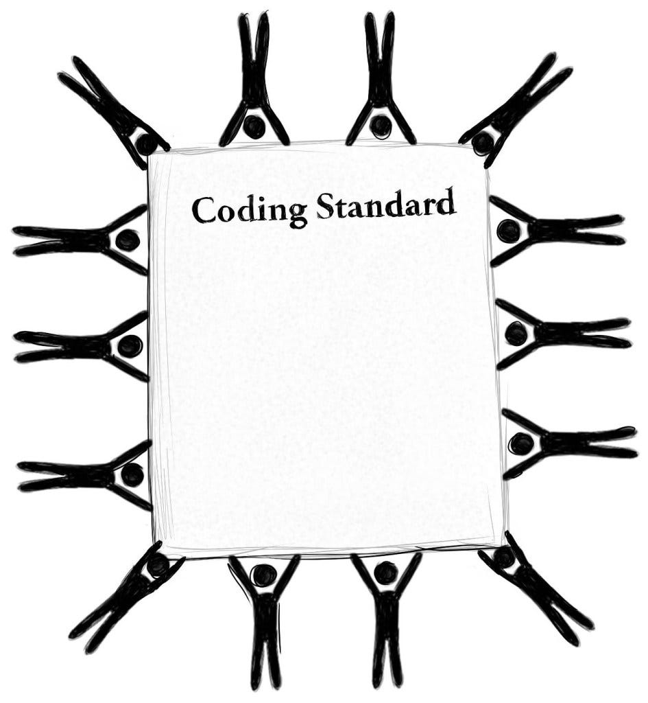

   

The answer to this question depends on who you ask. Personally, I would say yes. I consider myself someone who loves to have everything neat and organized, especially when it comes to coding. I often find myself spending a lot of time not only fixing syntax but also ensuring my code is readable. This applies not just to code that I know others will read but even to small exercises like practice WODs. Why? I'm not entirely sure, but I realize that I enjoy making my code look "pretty." This is why I really appreciate using tools like [ESLint](https://eslint.org) and [VSCode](https://code.visualstudio.com).  

## **First-Time Experience**  

### **VSCode**  

    
    

        Personally, I have been working with VSCode for many years. I have no complaints, it has been a fantastic development environment. When I first discovered the tool, I was shocked by how easy it made programming, especially when handling multiple files. Previously, I had been doing everything through the command line, so using VSCode took a lot of weight off my shoulders when managing different files in a fully functional program. I believe VSCode is an excellent tool that is both powerful and easy to use.  
    

  

 

### **ESLint**  

    
    

        I was first introduced to ESLint during my sophomore year while taking EE 205. Initially, I hated it because I kept having errors that I didn't think mattered much. For example: "*variable defined but never used,*" "*no-multiple-empty-lines,*" and so on. However, as I got used to following proper coding standards, I started making fewer mistakes. One of my favorite features is the command: `"npm run lint-fix"`. It’s amazing how my code can be formatted instantly without requiring manual adjustments. I personally enjoy using ESLint because it keeps my code clean and consistent effortlessly.  
    

## **Conclusion**  
In the end, coding standards are beneficial to follow. While they can be frustrating at first, once you become used to them, they make development much easier and more efficient. Using tools like VSCode and ESLint can improve coding workflow a lot, making code more readable, maintainable, and professional. Clean, well-structured code is not only satisfying to look at but also essential for collaboration and scalability. By following coding standards, developers can ensure their work is clear and efficient for both themselves and others in the long run.   

   

*AI used for checking spelling and nice formatting*
