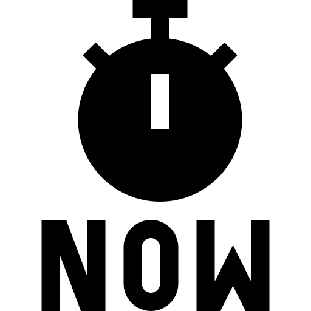
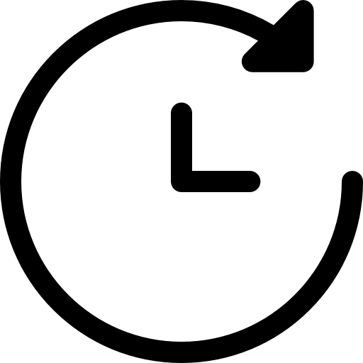

 that discusses your interests in software engineering and what kinds of skills and experiences you hope to develop in future.

<h4>Past</h4>   
  
Starting off as a Mechanical Engineering student, I discovered my passion for software while working on research in system automation. At the time, I was primarily working with Python and C, both of which were new to me. I quickly realized that I enjoyed programming more than I had expected, which motivated me to transfer to Computer Engineering. Since then, I’ve learned a great deal about different types of software, both inside and outside the classroom.   

Initially, I was particularly interested in system automation because it was both practical and rewarding. During this time, I also became familiar with markup languages like HTML and CSS for creating dashboards. Although I enjoyed working on dashboards, I realized that web design wasn’t my area of interest. My focus gradually shifted toward Machine Learning, particularly TinyML, which I find fascinating. I’m not only curious about different machine learning algorithms but also about optimization techniques that allow models to be deployed on embedded systems.   

 <h4>Present</h4>   

Recently, I’ve been working on a personal project where I developed an iOS app for Apple products. For this, I had to learn Swift, a high-level general-purpose programming language that I was unfamiliar with. The process of trial and error while building the app was incredibly rewarding, and I learned so much along the way. While I don’t consider myself an expert in Swift, I’m confident in my ability to navigate the language and develop functional apps. This experience reinforced one of the things I love most about software engineering: the abundance of open-source resources and tools available to learn any programming language.   

 <h4>Future</h4>   

Looking ahead, I’m eager to explore more programming languages that I’m not yet familiar with and apply them to practical projects. During the ICS 311 class, I hope to learn how to develop a fully functional web app and make it easy to update. My goal is to design it in a way that ensures future maintainability, so an outsider can easily understand the source code and make updates as needed. One of my long-term aspirations is to become proficient at quickly picking up new programming languages by simply reviewing their documentation.   
