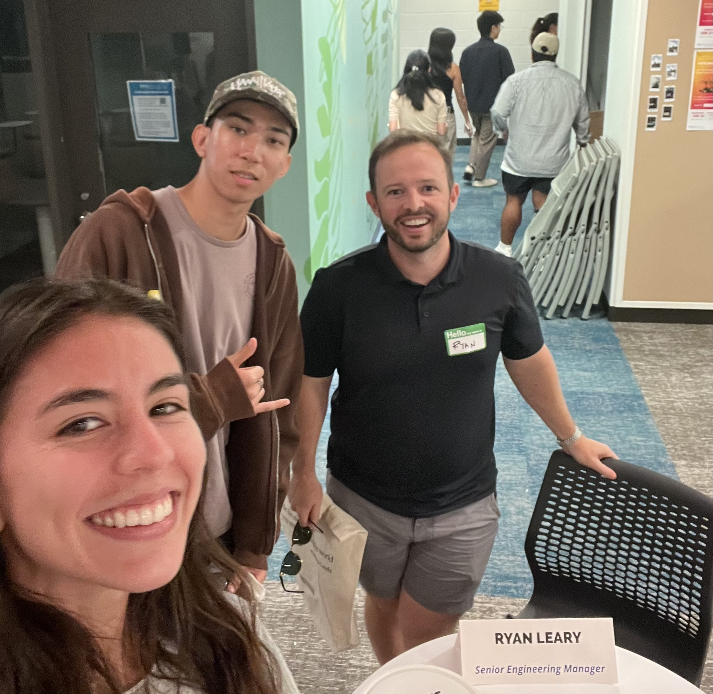

### What is PACE?  

    
    

        PACE stands for the Pacific Asian Center for Entrepreneurship and was established at the Shidler College of Business. It provides numerous opportunities for entrepreneurship and innovation to students across all 10 campuses of the University of Hawai‘i System. PACE offers various programs that provide mentorship, training, and resources designed to foster entrepreneurial thinking across disciplines. These programs aim to inspire entrepreneurs to transform their ideas from conceptualization to commercialization.    
    

  
 

### Tech Minds Meet Event  
When I first arrived at the event, I noticed many tables with experts ranging from consultants to tech entrepreneurs and engineering managers. At first I was scared of aproaching experts and starting a conversation, but as the event went by I got more confortable with talking to them which made me realize all they wanaa do is help us. I loved hearing about their experiences and how they led them to where they are today. The conversations were incredibly insightful, offering valuable advice on potential career paths and current trends in technology.  

I especially enjoyed speaking with professionals who had an entrepreneurial background and had been exposed to the startup ecosystem, which is an area I’m particularly interested in. Throughout the event, I only had the opportunity to talk to two people, as our conversations were long and in-depth with very insightful knowledge.   

### People  

    
    

        One of the most meaningful conversations I had was with Ryan Leary, a Senior Engineering Manager at Meta in the Reality Labs. We discussed various topics, including what his day-to-day work looks like and how he joined Meta. He explained that his primary role is overseeing other engineers and stepping in when needed. As a manager, he doesn't work directly on projects but instead gets to engage with multiple projects at a high level.  
    

A particularly interesting point he mentioned was how having competitors in the same field working on similar products, such as reality glasses, serves as product validation. It helps companies understand what customers want and how they can incorporate those insights into their own products. One key takeaway for me was that even if others are working on the same idea, you should keep pushing forward and learn from them.  

Another interesting insight he shared was that Mark Zuckerberg is deeply invested in the development of reality glasses. One valuable piece of advice I took from him was to always seize any available opportunity because you never know when it will come again.   
 
 
 
 
*Resources: ChatGPT for grammar checking.*