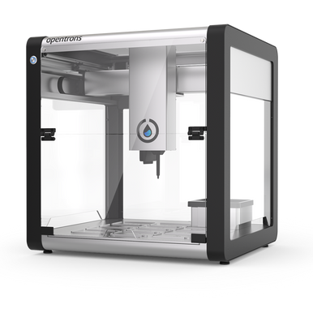

<h3>Thermal Measurement System Automation</h3>   
Automated a system developed by a graduate student to enhance data collection capabilities. Integrated a Raspberry Pi microcomputer into the existing setup to simplify the interface and facilitate system automation. Eliminated the need for manual connection of a laptop to the Heat Flux sensor and multimeter by enabling remote system access and maintaining full control through the Raspberry Pi.    

[Published Paper](https://doi.org/10.1115/IMECE2023-111923)   
“Rapid Cross-Plane Thermal Conductivity Characterization From Data Automation and System Miniaturization”     
IMECE2023-111923, V010T11A053   

[Project Paper](https://drive.google.com/file/d/1jtLJusf2CwBm4N-_Cg0nWW6clrF0IW9o/view?usp=sharing)   
   
[Presented Poster](https://drive.google.com/file/d/1__2qv2Z6dqavFSomHYjCfGehrsW6GugE/view?usp=sharing)   

<h3>Automation of Gas Adsorption Experiments using Quartz Crystal Microbalances</h3>   
Established seamless connectivity to Alicat Mass Flow and Pressure controllers through serial communication, enabling instrument access and data logging with a Quartz Crystal Microbalance. Developed Python libraries to retrieve device output data via serial commands. Created a Python script to control instrument valves, facilitating automated valve operations. Designed an industrial dashboard using HTML and CSS as a user interface, providing a visual representation of data received from the instrument.   

[Project Paper](https://drive.google.com/file/d/1mC9Y-JMEWRwtdl5_oVyP2e29gvFpoWnY/view?usp=sharing)   
   
[Presented Poster](https://drive.google.com/file/d/1CkNVEFqZ6HsTaXTmb5oWKI4htTX2UHZg/view?usp=sharing)   
   
[GitHub](https://github.com/andreamurillomtz/QCM)   

<h3>Liquid Handling Robot Error</h3>   
Analyzed the efficiency of the OpenTron OT-2 Robot by quantifying the fluid loss during pipetting. Calculated the amount of water lost when transferring liquid from a water reservoir to a scintillation vial, identifying potential inefficiencies and providing insights for optimization.   

   

