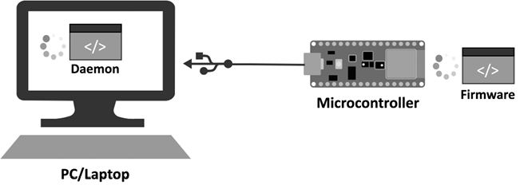
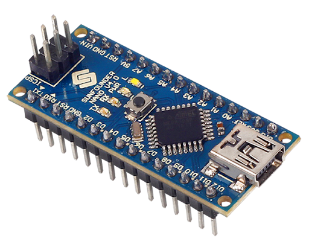

Implemented machine learning models on resource-constrained platforms such as Arduino Nano 33 and Raspberry
Pi Pico microcontrollers, utilizing TensorFlow and TensorFlow Lite for model development. Leveraged Google
Colab for training and optimization processes.   

Deployed a keyword spotting machine learning model onto an Arduino Nano 33, optimizing performance and
memory usage for real-time inference in resource-constrained environments.

