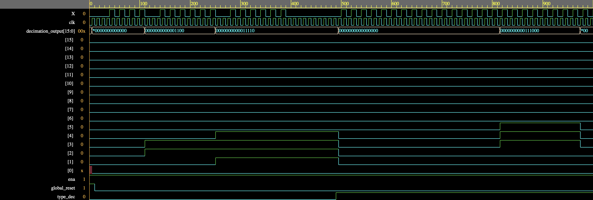

**Motivation**   
The rapid advancement of digital signal processing requires efficient and reliable ways of converting analog signals into high-quality digital data. Decimation filters, are essential for down sampling signals while maintaining their integrity and are crucial in analog-to-digital converters (ADCs).   

**Objective**   
Design a decimation filter for the ADC designed in ECE 628 utilizing incremental Delta-Sigma modulation. Utilizing Tiny Tapeout platform for tapeout make the manufacturing process cost-effective and accessible.

**Design Execution and Testing**   
<ins>Incremental ΔΣ Modulation ADC:</ins>    
Utilizes two integrators (accumulators), with its output synchronized to a reset signal to align with the incremental ADC’s operation.   

<ins>Free-running ΔΣ Modulation ADC: </ins>   
Utilizes a cascade-integrator comb (CIC) filter, consisting of two integrator parts (accumulators) and two comb parts (differentiators). The integrators’ output is passed through a comb filter, where the output is calculated as the difference between the delayed and current values.

**Final Design**   
Cells: 772 (excluding decoupling capacitors and filler cells)   
Flip-flops: 89   
Tiles: 1x1   

**Challenges**   
Making design synthesizable for ASIC implementation.   
     - Ensuring all variables were set to zero at the beginning of simulation (initial blocks are non-synthesizable)   
Using OSS CAD Suite, binary software distribution for several open-source software used in digital logic design.   
     - Local hardening dependency errors when running tools for RTL synthesis   
Ensuring documentation and design variables are correctly implemented to have a successful submission to Tiny Tapeout.   

Design was successfully submitted to the [Tiny Tapeout TT09](https://tinytapeout.com/runs/tt09/tt_um_murmann_group) run.

Learn more about [Tiny Tapeout]([https://manoa.hawaii.edu/news/article.php?aId=2857](https://tinytapeout.com)).

